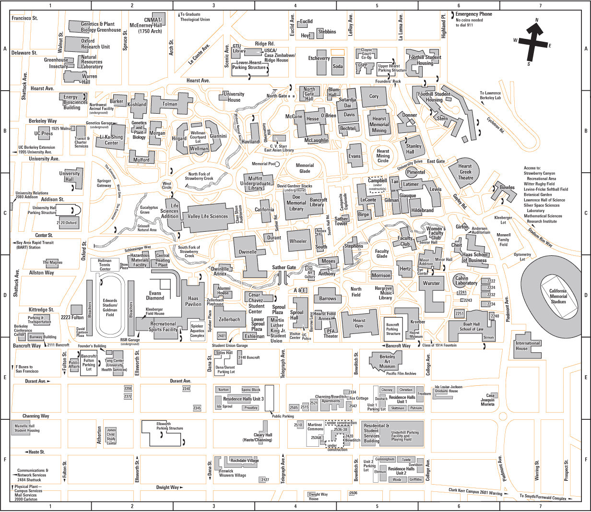

# Introduction 

What is COVID
<<< This is coming from the presentation >>

# Use Cases

## Primary Use Cases

## Secondary Use Cases

# Systems Design

## Map

In this section we will read the geo data of the Berkeley Campus Map.

### Population Density

Where do we get population density data?
Does it have to be real time population or over the day averages?

## Color Coding

Red, Yellow, Green - what does the colors mean?
How do we interpret the colors?

## covID Scanner

